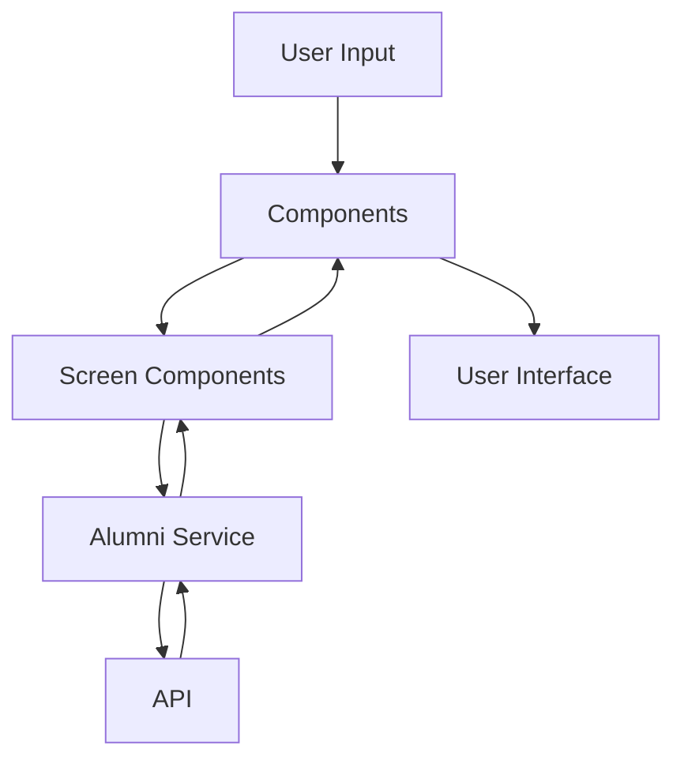

# Dokumentasi Sistem Aplikasi Alumni

## Daftar Isi
1. [Pendahuluan](#pendahuluan)
2. [Arsitektur Sistem](#arsitektur-sistem)
3. [Komponen Sistem](#komponen-sistem)
4. [Alur Data](#alur-data)
5. [Panduan Pengembangan](#panduan-pengembangan)

## Pendahuluan

Aplikasi Alumni adalah sistem berbasis React Native yang dirancang untuk mengelola dan menampilkan data alumni. Aplikasi ini menggunakan Expo sebagai framework utama dan mengimplementasikan desain material menggunakan React Native Paper.

### Teknologi Utama
- React Native 0.79.2
- Expo SDK 53
- TypeScript
- React Navigation 7
- React Native Paper
- Axios untuk HTTP requests

## Arsitektur Sistem

### Struktur Folder
```
src/
├── components/     # Komponen React yang dapat digunakan kembali
├── screens/        # Komponen layar utama
├── services/       # Layanan API dan business logic
└── types/         # TypeScript type definitions
```

### Pola Desain
1. **Component-Based Architecture**
   - Pemisahan komponen berdasarkan fungsi
   - Penggunaan props untuk komunikasi antar komponen
   - Implementasi TypeScript untuk type safety

2. **Service Layer Pattern**
   - Centralized API calls di alumniService
   - Error handling terpusat
   - Type-safe response handling

3. **State Management**
   - Penggunaan React Hooks (useState, useEffect)
   - Props drilling untuk data flow
   - Callback patterns untuk event handling

## Komponen Sistem

### 1. Komponen UI

#### FilterSection
- **File**: `src/components/FilterSection.tsx`
- **Fungsi**: Menyediakan filter untuk pencarian alumni
- **Fitur**:
  * Filter Provinsi
  * Filter Bidang Kerja
  * Filter Angkatan
  * Filter Program Studi
  * Reset filter
  * Apply filter

#### AlumniList
- **File**: `src/components/AlumniList.tsx`
- **Fungsi**: Menampilkan daftar alumni
- **Fitur**:
  * Card view untuk setiap alumni
  * Informasi detail alumni
  * Optimized rendering dengan FlatList
  * Handling press events

#### SearchBar
- **File**: `src/components/SearchBar.tsx`
- **Fungsi**: Pencarian alumni
- **Fitur**:
  * Real-time search
  * Submit handling
  * Material design

#### PaginationControl
- **File**: `src/components/PaginationControl.tsx`
- **Fungsi**: Navigasi halaman
- **Fitur**:
  * Previous/Next navigation
  * Page indicator
  * Disabled state handling

### 2. Screens

#### SarjanaScreen
- **File**: `src/screens/SarjanaScreen.tsx`
- **Fungsi**: Halaman utama daftar alumni sarjana
- **Fitur**:
  * Data fetching
  * Loading states
  * Error handling
  * Alumni list rendering

### 3. Services

#### alumniService
- **File**: `src/services/alumniService.ts`
- **Fungsi**: Komunikasi dengan API
- **Endpoints**:
  * GET /alumni - List alumni
  * GET /alumni/{id} - Detail alumni
  * GET /filters - Data filter
- **Fitur**:
  * Axios integration
  * Error handling
  * Type-safe responses

## Alur Data



1. User melakukan input (search/filter)
2. Component menangkap event
3. Screen component memanggil service
4. Service melakukan API call
5. Data dikembalikan dan dirender ke UI

## Panduan Pengembangan

### Setup Development Environment
1. Install dependencies:
```bash
npm install
# atau
yarn install
```

2. Start development server:
```bash
npm start
# atau
yarn start
```

### Menambahkan Fitur Baru
1. Buat komponen baru di `src/components`
2. Definisikan types di `src/types`
3. Tambahkan service calls jika diperlukan
4. Integrasikan ke screen yang sesuai

### Best Practices
1. Gunakan TypeScript untuk semua file baru
2. Implementasikan proper error handling
3. Dokumentasikan komponen dan functions
4. Gunakan React Native Paper untuk konsistensi UI
5. Optimasi performa dengan React.memo jika diperlukan

### Testing
- Unit tests untuk services
- Component testing dengan React Native Testing Library
- E2E testing dengan Detox

## Integrasi API

Aplikasi menggunakan API dari:
```
https://sarjana-katsgama.dev.ugm.ac.id/api
```

Dokumentasi lengkap API dapat dilihat di [docs-api.md](./docs-api.md) 